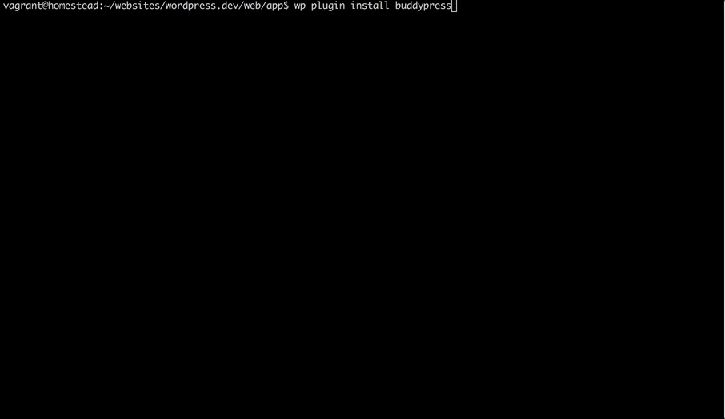

### WP-CLI + Composer - How to combine them?

Install the plugins listed in our composer.json file.

```
wp composer plugins install
```

Add the plugins and themes we have installed on our single or multisite to a composer.json file

```
wp composer add --all
```

Install plugins using WP-CLI and automatically add that plugin to composer.json file



Note:
- Talk about code